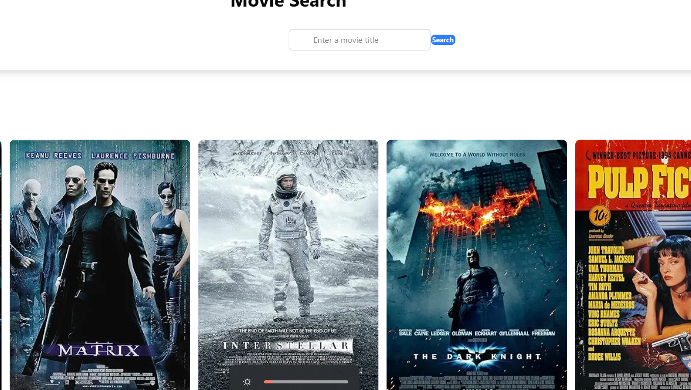

# Movie Search App

A simple React/Next.js application that allows users to search for movies using the OMDb API.

## Features

- Search for movies by title
- Display movie details including title, poster, release date, and rating
- Responsive design
- Loading states and error handling

## Screenshots!



## Technologies Used

- Next.js
- React
- Tailwind CSS
- Axios

## Prerequisites

Before you begin, ensure you have the following installed:
- Node.js (v14.x or later)
- npm or yarn

## Getting Started

1. Clone the repository:
   ```bash
   git clone https://github.com/yourusername/movie-search-app.git
   cd movie-search-app
   ```

2. Install dependencies:
   ```bash
   npm install
   # or
   yarn install
   ```

3. Get an API key from [OMDb API](https://www.omdbapi.com/apikey.aspx)

4. Create a `.env.local` file in the root directory and add your API key:
   ```
   NEXT_PUBLIC_OMDB_API_KEY=your_api_key_here
   ```

5. Update the API key in the code:
   Open `pages/index.js` and replace `'YOUR_OMDB_API_KEY'` with:
   ```javascript
   const API_KEY = process.env.NEXT_PUBLIC_OMDB_API_KEY;
   ```

6. Start the development server:
   ```bash
   npm run dev
   # or
   yarn dev
   ```

7. Open [http://localhost:3000](http://localhost:3000) in your browser to see the app.

## Building for Production

```bash
npm run build
# or
yarn build
```

Then start the production server:

```bash
npm start
# or
yarn start
```

## Deployment

The easiest way to deploy this app is using [Vercel](https://vercel.com/), the platform built by the creators of Next.js:

1. Push your code to a GitHub repository
2. Import the project into Vercel
3. Add your environment variables
4. Deploy

## Future Improvements

- Add pagination for search results
- Implement a favorites feature
- Add more detailed movie information
- Enhance the UI with animations
- Deployed

## License

MIT